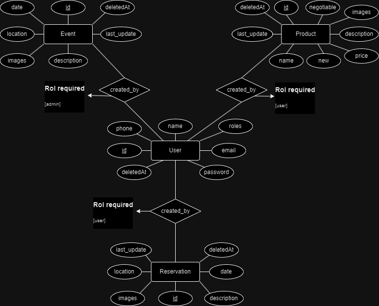
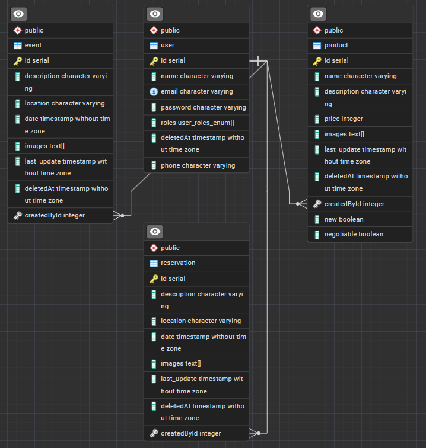

# ConnectEIA
Backend para el proyecto de ConnectEIA


## Diagramas
**Diagrama Entidad-Relacion**


---
**Diagrama Base de datos**



## Ejecutar
**Variables necesarias en el .env para modo dev:**
```
DB_HOST=
DB_PORT=
DB_USERNAME=
DB_PASSWORD=
DB_NAME=
DB_SSL=
JWT_SECRET=
JWT_REFRESH_SECRET=
```

**Levantar BD con docker:**
```
docker compose up -d
```

**Descargar dependencias:**
```
npm i
```

**Ejecutar modo dev:**
```
npm run dev
```


## Contenido
- *Documentación con swagger*
- *Base de Datos con postgres (NoSQL)*
- *Tipos de usuarios*
  1. **user:** por defecto
  2. **admin:** permiso para hacer todo


## Modulos
### Auth
**Rutas:**
- **Post** *(/auth/register) Register:* Crear nuevo usuario y devuelver sus credenciales
- **Post** *(/auth/login) Login:* Devuelver las credenciales; por autenticación email-password
- **Post** *(/auth/refresh-token) Refresh Token:* Devuelver las credenciales; con refreshToken

---
### User
**Rutas:**

*Requieren Rol user o admin*
- **Get** *(/user) Profile:* Devuelve la informacion del usuario que hace la petición
- **Patch** *(/user) Update:* Actualizar al usuario que hace la petición
- **Delete** *(/user/:id) Remove:* Eliminar al usuario que hace la petición

*Requieren Rol admin*
- **Get** *(/user/users) FindAll:* Devuelve todos los usuarios; ordenados por id
- **Get** *(/user/:id) FindOne:* Devuelve el usuario con el id proporcionado
- **Post** *(/user) CreateUser:* Crear un usuario
- **Patch** *(/user/:id) UpdateUser:* Actualizar un usuario
- **Delete** *(/user/:id) RemoveUser:* Eliminar un usuario

---
### Event

---
### Product
**Rutas:**

*Requieren Rol user*
- **Get** *(/product) Find Products:* Devuelve todos los productos
- **Get** *(/product/my-products) Find My Products:* Devuelve todos los productos en que el que hace la peticion es el creador
- **Get** *(/product/:id) Find Product:* Devuelve el producto con el id proporcionado
- **Post** *(/product) Create Product:* Crear un producto
- **Patch** *(/product/:id) Edit Product:* Editar el producto con el id proporcionado
- **Delete** *(/product/:id) Delete Product:* Eliminar un producto con el id proporcionado

---
### Reservation
---

## Info util
### Crear nuevo proyecto basado en esta plantilla
1. *Clonar la plantilla:*
```
git clone https://github.com/DavidBetancurRamirez/nestjs-plantilla.git nuevo-proyecto
```

2. *Agregar la plantilla como un repositorio remoto adicional (upstream):*
```
git remote add upstream https://github.com/DavidBetancurRamirez/nestjs-plantilla.git
```

---
### Actualizar cambios desde la plantilla
1. *Obtener cambios de la plantilla (upstream):*
```
git fetch upstream
```

2. *Aplicar cambios de la plantilla (upstream):*
```
git merge upstream/main
```
O tambien:
```
git rebase upstream/main
```

3. *Resolver conflictos:*
Puede que algunos cambios no se hagan de manera automatica y generen conflictos y halla que resolverlos y realizar un commit adicional

---
### Generar un modulo por comandos:
```
nest g res name --no-spec
```

---
### Para implementar la autenticación en otro modulo:
*example.module.ts*
```
@Module({
  imports: [AuthModule],
})
export class ExampleModule {}
```

---
### Para usar modulo con entidad:
*example.module.ts*
```
@Module({
  imports: [TypeOrmModule.forFeature([Example])],
})
export class ExampleModule {}
```
